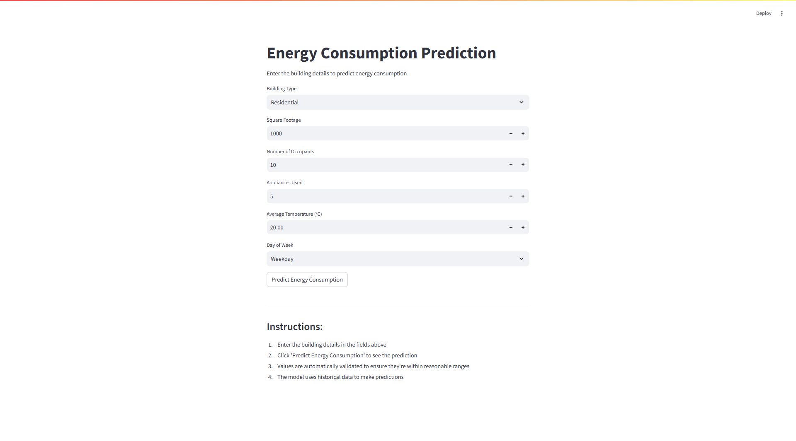
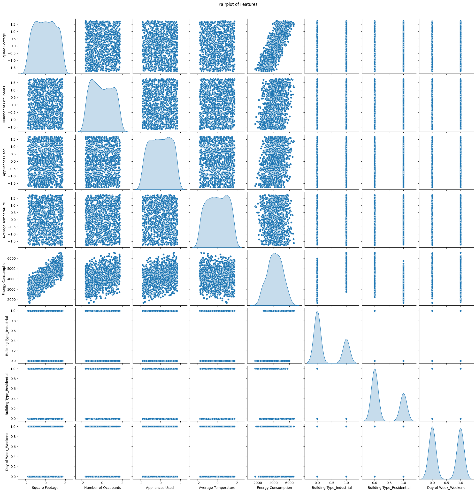

# Energy Consumption Prediction

Welcome to the Energy Consumption Prediction project! This repository contains code and resources for training a linear regression model to predict energy consumption based on various building parameters. The project includes data preprocessing, exploratory data analysis (EDA), model training and evaluation, and a web interface for making predictions.

## Overview

The goal of this project is to predict the energy consumption of buildings based on features such as:
- Building Type
- Square Footage
- Number of Occupants
- Appliances Used
- Average Temperature
- Day of Week

The project employs a linear regression model, and the workflow includes:
- Data ingestion and preprocessing
- Handling missing data
- Data normalization using a `StandardScaler`
- One-hot encoding of categorical features
- Model training, evaluation, and persistence using `pickle` and `joblib`
- Visualization and exploratory data analysis (EDA) using seaborn and matplotlib

## Project Structure

- **app.py**: The main application file (likely a web app using Streamlit) for real-time predictions. Check out the footer instructions in [app.py](app.py).
- **EnergyConsumptionPrediction.ipynb**: A Jupyter Notebook for interactive exploration.
- **training.ipynb**: A Jupyter Notebook containing the full workflow for data preprocessing, model training, evaluation, and saving the model.
- **linear_regression_model.pkl**: Pickled trained linear regression model.
- **scaler.pkl**: Pickled scaler used to standardize the numerical features.
- **train_energy_data.csv** & **test_energy_data.csv**: Datasets for training and testing.
- **images/**: Directory containing images. See below for screenshots.

- **requirements.txt**: A list of Python dependencies.
- **LICENSE**: Project license.
- **README.md**: This file.

## Installation

1. **Clone the repository:**

   ```sh
   git clone https://github.com/yourusername/EnergyConsumptionPrediction.git
   cd EnergyConsumptionPrediction
   ```

2. **Create a virtual environment (optional but recommended):**

   ```sh
   python -m venv venv
   source venv/bin/activate  # On Windows use: venv\Scripts\activate
   ```

3. **Install dependencies:**

   ```sh
   pip install -r requirements.txt
   ```

## Usage

### Training the Model

To train the model from scratch:

1. Open the training.ipynb notebook in Jupyter Notebook or Google Colab.
2. Run the cells sequentially to:
   - Load and preprocess the data.
   - Train the linear regression model.
   - Evaluate model performance.
   - Save the trained model using `joblib` and the scaler using `pickle`.

   The notebook includes cells for data exploration, normalization, one-hot encoding, and visualization of training results.

### Running the Web App

A web interface is provided for real-time predictions:

1. Ensure that the trained model and scaler are available in the project directory (`linear_regression_model.pkl` and scaler.pkl).
2. Run the app using Streamlit:

   ```sh
   streamlit run app.py
   ```

3. Follow the on-screen instructions to enter building details and predict energy consumption.

## Data

- **Training Data:** train_energy_data.csv
- **Test Data:** test_energy_data.csv

## Dataset Reference

This dataset is designed for predicting energy consumption based on various building features and environmental factors. It contains data for multiple building types, square footage, the number of occupants, appliances used, average temperature, and the day of the week. The goal is to build a predictive model to estimate energy consumption using these attributes. 

The dataset can be used for training machine learning models such as linear regression to forecast energy needs based on the building's characteristics. This is useful for understanding energy demand patterns and optimizing energy consumption in different building types and environmental conditions.

Link: [Kaggle Energy Consumption Dataset](https://www.kaggle.com/datasets/govindaramsriram/energy-consumption-dataset-linear-regression?select=train_energy_data.csv)

## Results

Model evaluation metrics and visualizations such as scatter plots, pairplots, and correlation heatmaps are generated in the notebooks. The model summary includes coefficients and intercept, with performance measured using metrics like Mean Squared Error (MSE) and R² score.

## Screenshots

Here are some screenshots from the project:

### Web Application UI



### Training Visuals


.png)
.png)
.png)
.png)

## Dependencies

The project is built with the following main libraries:

- Python 3.x
- pandas
- numpy
- scikit-learn
- matplotlib
- seaborn
- joblib
- pickle
- streamlit

All dependencies are listed in requirements.txt.

## License

This project is licensed under the terms specified in the LICENSE file.

---

Happy predicting!
````
